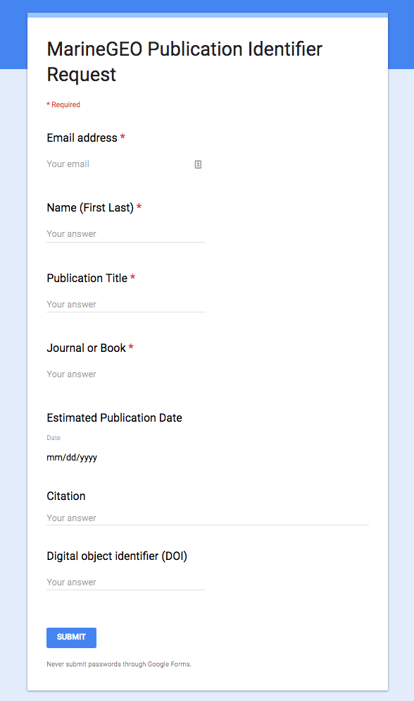
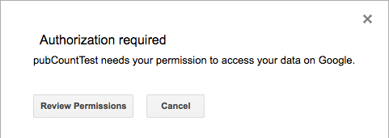
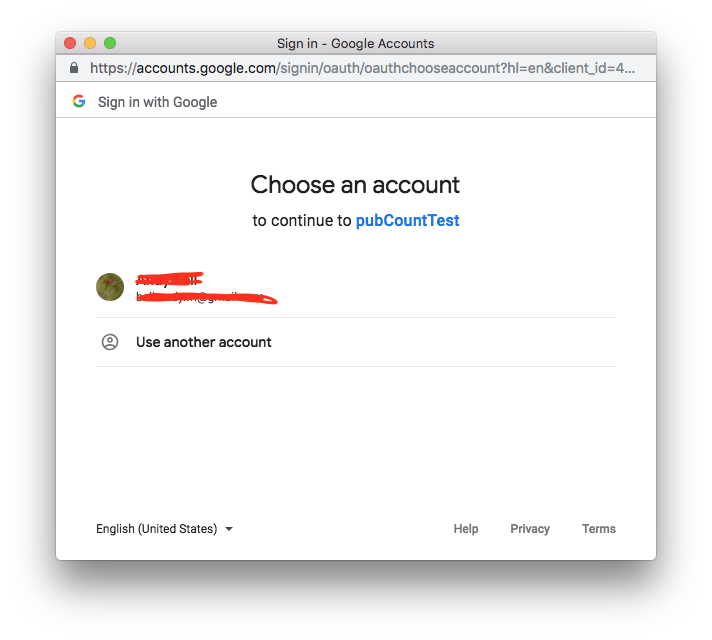
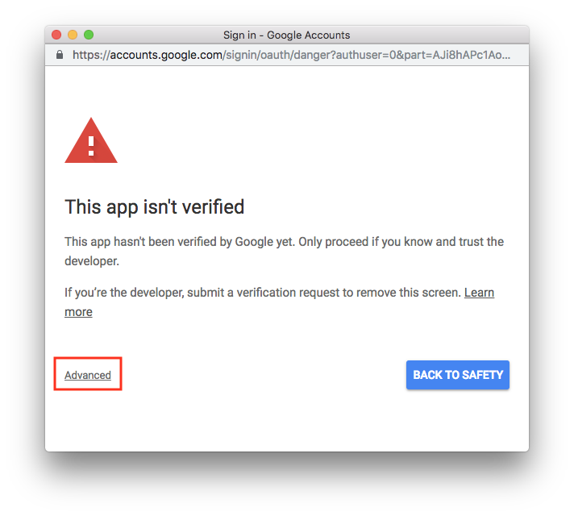
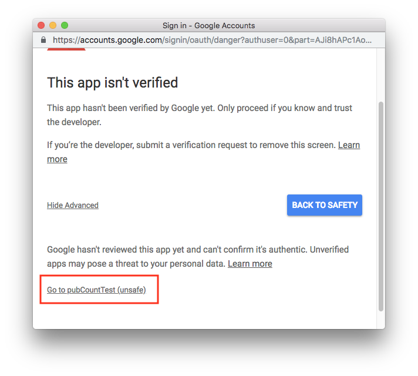
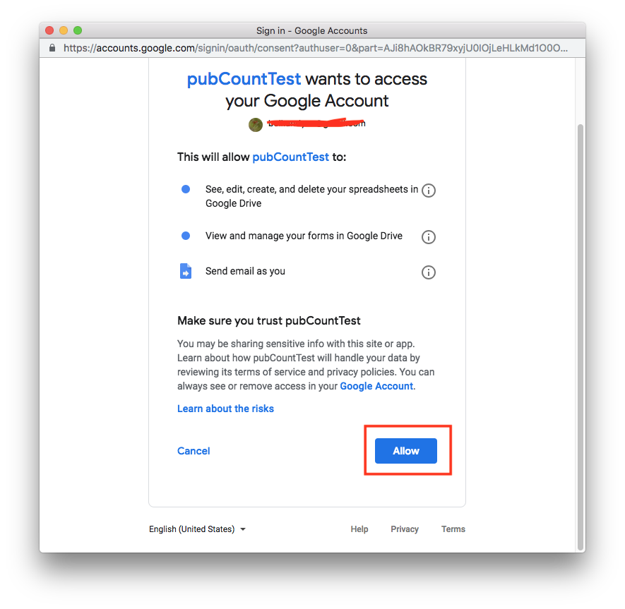

# MarineGEO Publication Contribution Number Assignment

The MarineGEO contribution number assignment tool is a self-service form that allows partners in the network to request contribution numbers for publications. When a user submits the google form to request a number, the Google Apps script assigns the next contribution number and emails the user with the number and the proper language to include in the acknowledgements section of their publication.

## What is a MarineGEO contribution number?

Contribution numbers are sequentially assigned and are used to track publications from the network as well as acknowledge that MarineGEO served as a source of funding. The following language should be included in the acknowledgements section of the publication: “This is contribution # from the Smithsonian’s MarineGEO Network.”

## My paper just got accepted, how can I request a MarineGEO contribution number?

1. After your paper is accepted by a journal, please use the self-service tool to request a MarineGEO contribution number. https://marinegeo.si.edu/publication-request-form

2. After the form is submitted, an automatic email notification will be sent that contains the assigned contribution number.

3. When the paper is published, please notify marinegeo@si.edu and include the DOI and full citation. We will add the publication to the MarineGEO Publications List and share it on social media. Congratulations on having your paper published!

## Setup
The publication assignment tool is built on top of Google Forms/Sheets. The assignment tool has three main components: a google form to collect responses, a connected google sheet to store all the responses and several custom javascript functions to generate the next contribution number and send an email.

### Google Form
The google form needs the following fields:
 - Email address - email address field type
 - Name (First Last) - Short Answer Text
 - Publication Title - Short Answer Text
 - Journal or Book - Short Answer Text
 - Estimated Publication Date - Date (Optional)
 - Citation - Long answer text (Optional)
 - Digital object identifier (DOI) - Short answer text (Optional)

### Google Response Sheet

Create a spreadsheet from the Google Form to store the responses.

Modify the spreadsheet using the following steps:
  - Insert a new column in the first position (Column A) called ID
  - Insert a new column (Column J) after the DOI, called EmailConfirmation
  - Insert a new column (Column K) after the DOI, called ResponseURL
  - In the M1 cell, insert the text "Next Pub Number"
  - In the N1 cell, insert the formula "=max(A:A)+1"
  - In the first spreadsheet row, create a placeholder by filling out the ID with the most recent contribution number.
  - Double check that the number in cell N1 is the next sequentially number

### Script Editor

 - Open Google Sheets Script Editor (Tools -> Script Editor)
 - Copy the function from `pubCounter.js` into the code console and save the project
 - Run the script by clicking the play button
 - Authorize the script to access your data.

#### Send email manually
In the script editor, uncomment the `manualEmail()` function and add the ID of the publication to resend the email. Run the script by clicking the play button.

#### Add entry to sheet
Entries can be manually added to the google sheet in order to preserve the record of requests and make sure the next sequential number is queued up.

#### Removing duplicates/mistakes
Mistake or duplicate request can be removed by deleting the appropriate data row in the spreadsheet. 
